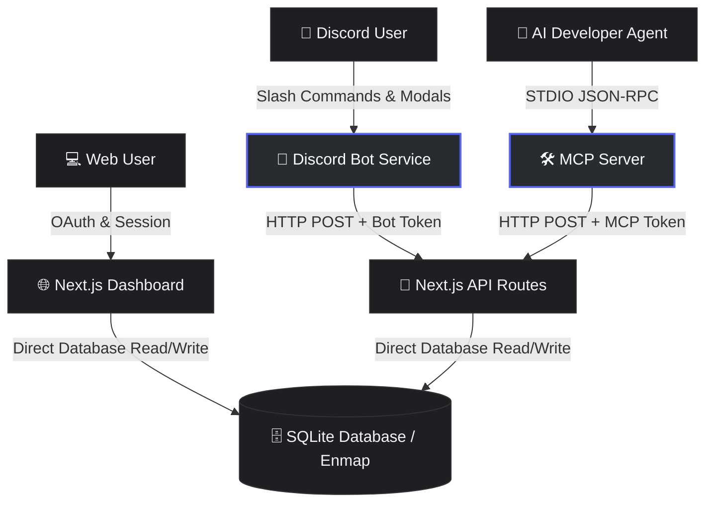

<div align="center">
  <br />
  
  <br />
  <h1>TODO FLOW</h1>
  <p><strong>Premium Task Management Ecosystem for Developers</strong></p>
  <p><i>A Monorepo-based Task Management Suite with a Web Dashboard, interactive Discord Bot, and Model Context Protocol (MCP) server.</i></p>

  <br />

  <div align="center">
    <a href="https://nextjs.org/"></a>
    <a href="https://discord.js.org/"></a>
    <a href="https://modelcontextprotocol.io/"></a>
    <a href="https://clerk.dev/"></a>
    <a href="https://sqlite.org/"></a>
    <a href="https://tailwindcss.com/"></a>
    <a href="https://www.docker.com/"></a>
  </div>

  <br />
</div>

---

## The Todo Flow Vision

**Todo Flow** is a premium task management ecosystem tailored for modern developer workflows. Instead of context-switching between tools, Todo Flow integrates task tracking directly into the environments where developers live: a responsive web browser, Discord channels, and developer agents/CLIs.

By utilizing a monorepo workspace structure, the ecosystem shares database rules, schemas, and configurations while running decoupled client applications securely using custom token authorization.

---

## 🏗️ System Architecture

Todo Flow operates as a distributed system centered around a Next.js database authority. The Discord bot and MCP server communicate with the primary database using secure HTTP API requests authenticated via unique tokens.



---

## 📦 Monorepo Workspace Structure

The project is structured as an npm monorepo with three primary workspaces:

### 1. [🌐 Web Dashboard](file:///c:/Codes/projects/todo/apps/web) (`apps/web`)
A Next.js server application acting as the primary database controller and dashboard.
* **Database**: Persistent local SQLite instance managed using Enmap.
* **Authentication**: Clerk OAuth integration for secure user accounts.
* **Theme System**: Premium design system with Light, Dark, and Cozy Gray (Discord-matching) themes, complete with a pre-hydration blocker to prevent flashes.
* **Features**: Mobile-responsive sidebar overlay, calendar date pickers with validation, interactive sub-todo checklists, and markdown clipboard exporters.

### 2. [🤖 Discord Bot Service](file:///c:/Codes/projects/todo/apps/discord-bot) (`apps/discord-bot`)
An interactive bot connecting chat channels to your task list.
* **Interactive Views**: Custom embeds with page-switching buttons, select dropdowns, and private modals for secure creation and editing.
* **Capture Mode**: A stateful collector loop allowing users to write/paste multiple sub-todos directly in chat, with a 1-minute auto-timeout fallback.
* **Unlinking & Guardrails**: Secure `/todo link` and `/todo unlink` controls to manage account mappings with ease.

### 3. [🛠️ Model Context Protocol Server](file:///c:/Codes/projects/todo/apps/mcp-server) (`apps/mcp-server`)
An executable command-line package designed to run over standard stdio.
* **NPM Registry Ready**: Configured with `tsup` compilation to automatically prepending the Node executable shebang (`#!/usr/bin/env node`).
* **AI Tooling**: Exposes 5 core tools (`list_todos`, `create_todo`, `complete_todo`, `delete_todo`, `edit_todo`) for LLM agents to interact with the database.

---

## 🚀 Getting Started

### 1. Clone & Install Dependencies
Run the installation command in the monorepo root:
```bash
npm install
```

### 2. Environment Setup
Create a `.env` file in the monorepo root. See `.env.example` for reference:
```env
# Clerk Auth
NEXT_PUBLIC_CLERK_PUBLISHABLE_KEY=your_key
CLERK_SECRET_KEY=your_secret

# Database & Token Secrets
DISCORD_BOT_TOKEN=your_bot_token
TODO_BOT_SECRET=your_api_communication_token

# Web URL
NEXT_PUBLIC_APP_URL=http://localhost:3000
```

### 3. Local Development Run
Run all services simultaneously in development mode:
```bash
npm run dev
```
* **Web Server**: `http://localhost:3000`
* **Discord Bot**: Runs and logs in with the specified client secret token.
* **MCP Server**: Can be tested locally or pointed to using the published npm package [`todo-flow-mcp`](https://www.npmjs.com/package/todo-flow-mcp) via `npx todo-flow-mcp`.

### 4. Docker Production Run
Build and run the entire suite in lightweight, isolated Docker containers using the custom bridge network:
```bash
docker compose up --build -d
```
The database volume (`todo_db_data`) is mapped to `/app/apps/web/database` inside the web container to persist tasks across deployments.

* **Web App**: Exposed on host port `3010` (mapped to `https://todo.jene.in`)
* **MCP Server (SSE)**: Exposed on host port `3011` (mapped to `https://todo-mcp.jene.in/sse`)
* **Discord Bot**: Connects internally to the Next.js database using the private Docker bridge network.
